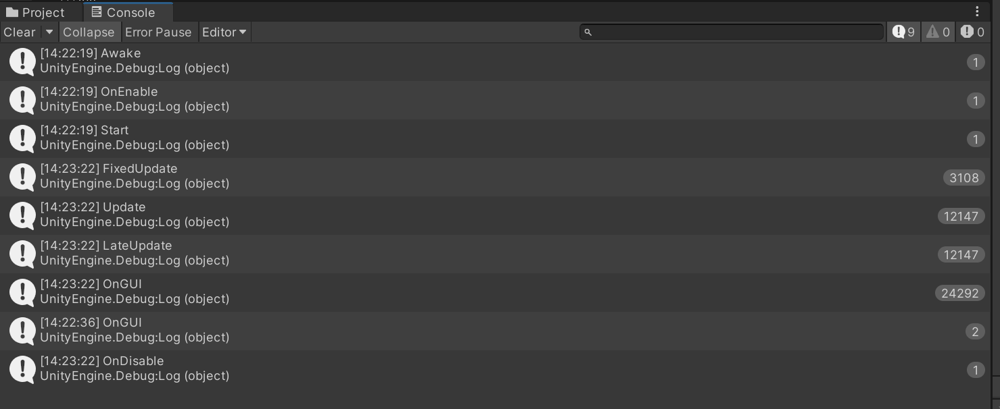
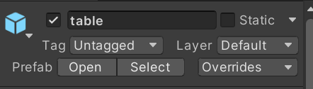
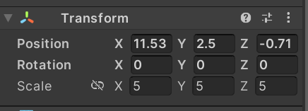
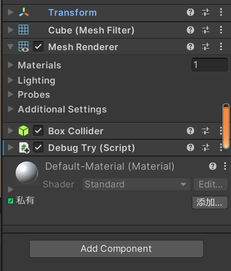
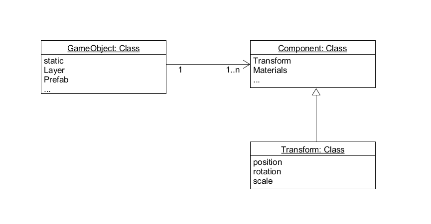
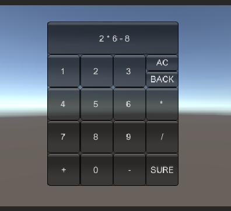
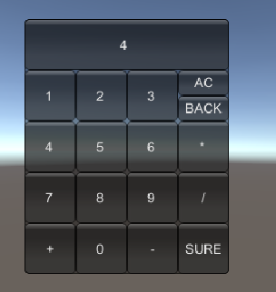

# 一、简答题
## 1. 解释游戏对象和资源的区别和联系。
游戏对象（GameObjects）是游戏程序空间中的事物，可能是Empty、2D、3D、光线、摄像机等。指的是一个能够容纳实现实际功能的组件。

游戏资源（Assets）是构造游戏对象、装饰游戏对象、配置游戏的物体体和数据。即序列化的或存储格式的游戏对象或数据。

资源是在游戏中可以使用的各种素材，而游戏对象则是指在游戏中容纳素材并发挥其作用的基本对象。游戏对象是已经存在在场景上的，而游戏资源只是可以使用的，并不一定被使用。

## 2. 下载几个游戏案例分别总结资源、对象组织的结构。
下载了Unity Asset Store 的 Unity's Visual Scripting Tutorial 作为案例。
得到其游戏对象树如下图所示：


得到其资源的目录组织结构如下图所示：


通过观察游戏案例可以分析得出，游戏资源目录包括了创建该游戏要用到的全部内容，包括Font、Material、Models等。这些资源按照类别的不同分类存储。

而游戏对象树则包括了游戏中出现的所有对象，这些对象有的由多个组成（所以可以下拉）且存储在一起，在使用时被看作是一个整体。

## 3. 编写一个代码，使用debug语句来验证MonoBehaviour基本行为或事件触发的条件。

编写代码如下：

```
using System.Collections;
using System.Collections.Generic;
using UnityEngine;

public class DebugTry : MonoBehaviour
{
    void Start(){
        Debug.Log("Start");
    }
    void Awake(){
        Debug.Log("Awake");
    }
    void FixedUpdate(){
        Debug.Log("FixedUpdate");
    }
    void LateUpdate(){
        Debug.Log("LateUpdate");
    }
    void Update(){
        Debug.Log("Update");
    }
    void OnGUI(){
        Debug.Log("OnGUI");
    }
    void OnDisable(){
        Debug.Log("OnDisable");
    }
    void OnEnable(){
        Debug.Log("OnEnable");
    }
}

```

运行结果示意图如下：



 由结果可知，Awake、OnEnable、Start、OnDisable仅在运行了一次，FixedUpdate、Update、LateUpdate、OnGUI则多次调用。
Awake：启动任何函数之前且在实例化预制件之后调用。

Start：启动脚本时调用。

Update：启动脚本后，每次进行update时都会调用。每帧调用一次。

Fixedupdate：固定更新，调用次数与Update不同，但通常比之更频繁。

LateUpdate：每次更新结束后调用。

OnGUI：处理GUI事件时调用，每帧调用多次。

OnEnable：只在对象处于活动状态时才会被调用。

OnDisable：当结束运行，对象不再运行时，调用此函数。

## 4. 查找脚本手册，了解GameObject，Transform，Component对象。

### 分别翻译官方对三个对象的描述

GameObject ：Base class for all entities in Unity Scenes.

翻译为：Unity场景中所有实体的基类。

Transform ：Position, rotation and scale of an object.

翻译为：一个对象的位置、角度和规模。

Component ：Base class for everything attached to GameObjects.

翻译为：与GameObjects相关联的所有东西的基础类。

### 描述下图中table对象（实体）的属性、table的Transform属性、table的部件

如图所示，图中对象的属性包括activeSelf 属性，对象的名称，是否为Static，以及Tag、Layer、Prefab、Overrides这几个。



如图所示，图中Transform包括了Position（位置）、Rotation（角度）和Scale（规模），分别又分为x,y,z三轴表示。



如图所示，table的部件有Transform、Cube(Mesh Filter)、Materials、Lighting、Probes、Additional Settings和Box Collider。除此之外，还可以进行增加，如图中的Debug Try就是认为增加的。



### 用UML图描述三者关系

绘制UML图，图片如下：


## 5. 资源预设与对象克隆。

### 预设有什么好处
预设（Prefabs）是文件存储的游戏对象与属性的组合，可一次性方便地加载到内存。如果说游戏对象是原材料，那么预设就是半成品。而在实际使用的时候，可能出现同样地内容的反复使用，如果已经有了半成品，只需要直接使用半成品即可，否则每次都要从原材料开始重新制作。可以说预设大大节省了制作时间。除此之外，预设还方便进行更改。只要修改了预设，那么其他的所有由预设创造的对象都会产生相应的变化。

### 预设与对象克隆的关系
克隆（clone）和预设类似，都是通过复制产生游戏对象。但区别在于，预设是提前准备好的，放在资源区域，调用即可，而克隆则要求场景上已经有了该游戏对象，而后进行复制。此外，克隆产生的新的游戏对象相较于原来的是独立的，无法做到一变百变。

### 制作table预设
代码如下：
```
using System.Collections;
using System.Collections.Generic;
using UnityEngine;

public class loader : MonoBehaviour
{
    public Transform res;
    // Start is called before the first frame update
    void Start()
    {
        Transform gameObject_trans = Instantiate<Transform>(res,this.transform);
        gameObject_trans.position = new Vector3(0,Random.Range(-5, 5),0);
    }

    // Update is called once per frame
    void Update()
    {
        
    }
}

```


# 二、编程实践，小游戏
编写内容为简易计算器，实现了整数的加减乘除，代码如下：
```
using System.Collections;
using System.Collections.Generic;
using UnityEngine;
using System;
using System.Linq;

public class SimpleCalcu : MonoBehaviour
{
    public static double sum;
    public static string Comm;
    private int Sure;
    // Start is called before the first frame update
    void Start()
    {
        Init();
    }

    void OnGUI()
    {
        GUI.Box(new Rect(210,25,200,250),"");
        if(GUI.Button(new Rect(360,75,50,25),"AC")) Init();
        if(GUI.Button(new Rect(360,100,50,25),"BACK")) removeEnd();
        if(GUI.Button(new Rect(360,225,50,50),"SURE")) {
            sum = CalculateNum(Comm);
            ShowResult(sum);
        }
        if(GUI.Button(new Rect(210,25,200,50),Comm));
            for(int i=1;i<=9;i++){
                if(GUI.Button(new Rect(210+(i-1)%3*50,25+((i-1)/3+1)*50,50,50),i.ToString())){
                    addS(i.ToString());
                }
            }
            if(GUI.Button(new Rect(260,225,50,50),"0")){
                addS("0");
            }
            if(GUI.Button(new Rect(210,225,50,50),"+")){
                addS("+");
            }
            if(GUI.Button(new Rect(310,225,50,50),"-")){
                addS("-");
            }
            if(GUI.Button(new Rect(360,125,50,50),"*")){
                addS("*");
            }
            if(GUI.Button(new Rect(360,175,50,50),"/")){
                addS("/");
            }
    }

    void Init(){
        sum = 0;
        Comm = " ";
        Sure = 0;
    }
    void addS(string a){
        if(Sure!=1){
                if(Comm.Length>0&&char.IsDigit(Comm[Comm.Length-1])){
                    if(char.IsDigit(a[0]))
                        Comm = Comm + a;
                    else
                        Comm = Comm + " " + a + " ";
                }
                else{
                    if(char.IsDigit(a[0]))
                        Comm = Comm + a;
                    else
                        Comm = Comm + a +" ";
                }     
        }  
    }
    void removeEnd(){
        if(Sure == 1){
            Comm = " ";
            Sure = 0;
        } 
        if(Comm.Length>=1)
            Comm = Comm.Substring(0,Comm.Length - 2);
    }
    void ShowResult(double a){
        Comm = a.ToString()+" ";
        Sure = 1;
    }
    double CalculateNum(string a){
        Stack num = new Stack();
		double k = 0,zhf=1;
		for(int i=0;i<a.Length;i++){
			if(char.IsDigit(a[i])) k = k*10+a[i]-'0';
			else if(a[i] == ' '){
				if(i>0&&char.IsDigit(a[i-1])){
					num.Push(k*zhf);
					k=0;
					zhf = 1;
				}
			}
			else{
				if(a[i] == '-'){
					zhf = -1;
				}
				else if(a[i] == '*' || a[i] =='/'){
					double zan = (double)num.Peek();
					char ww = a[i];
					num.Pop();
					i+=2;
					for(;i<a.Length;i++){
						if(a[i]==' ') break;
						else k = k*10+a[i]-'0';
					}
					if(ww == '*') zan = zan * k;
					else zan = zan / k;
					if(i<a.Length) {
						num.Push(zan);
						k=0;
					}
					else {
						k = zan;
						zhf = 1;
					}
				}
			} 
		}
		k *=zhf;
		while(num.Count>0){
			double aa = (double)num.Peek();
			num.Pop();
			k = k+aa;
		}
		return k;
    }
}


```
运行结果如下（第一张为输入式子，第二张为计算结果）：

   